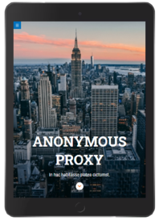
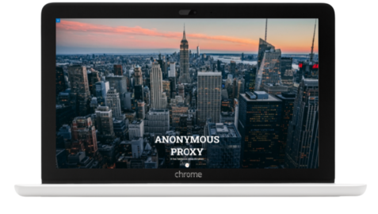

# **Anonymous Proxy Landing Page**

## **About**

Module 1 final project of the Adalab Digital Frontend Development Bootcamp.

This is a responsive landing page developed with [](https://html.spec.whatwg.org/) [](https://www.w3.org/Style/CSS/) and [](https://sass-lang.com/)

**[Project URL](https://anaguerraabaroa.github.io/anonymous-proxy-landing-page/)** is available on GitHub Pages.

## **Quick start guide**

Instructions to start this project:

## Installation

- Clone repository:

```
git clone [repository]
```

- Install NPM packages and dependencies:

```
npm install
```

- Run project on local server:

```
npm start
```

## **Features**

- Responsive web design for mobile, tablet and desktop devices
- Fixed header navigation menu with fake links
- Full screen hero image designed with flexbox
- Tips section designed with flexbox or CSS grid
- Articles section designed with CSS grid
- Footer designed with flexbox and fake navigation menu links
- Hero button linked to articles section
- Footer button linked to the top of the page
- Footer button with animation transition
- Section buttons with hover transition

## **Folder Structure**

```
Anonymous Proxy Landing Page
├── docs
├── node_modules
├── public
├── src
│   ├── html
│   │   ├── partials
│   │   │   ├── footer.html
│   │   │   ├── header.html
│   │   │   ├── hero.html
│   │   │   ├── main-article.html
│   │   │   ├── main-reasons.html
│   │   │   ├── main-tips.html
│   │   │   └── main.html
│   │   └── index.html
│   ├── images
│   │    ├── cover.jpg
│   │    ├── ico-arrow.jpg
│   │    ├── ico-menu.svg
│   │    ├── ico-scroll-down.svg
│   │    ├── landing_desktop.png
│   │    ├── landing_mobile.png
│   │    └── landing_tablet.png
│   └── scss
│       ├── components
│       │   └── _typography.scss
│       ├── core
│       │   ├── _reset.scss
│       │   └── _variables.scss
│       ├── layout
│       │   ├── _footer.scss
│       │   ├── _header.scss
│       │   ├── _hero.scss
│       │   ├── _main-reasons.scss
│       │   └── _main-tips.scss
│       └── main.scss
├── .browserslistrc
├── .csscomb.json
├── .eslintrc.json
├── .gitignore
├── config.json
├── gulp-flow.png
├── gulpfile.js
├── LICENSE
├── package-lock.json
├── package.json
├── README.md
└── robots.txt
```

## **License**

This project is licensed under 
